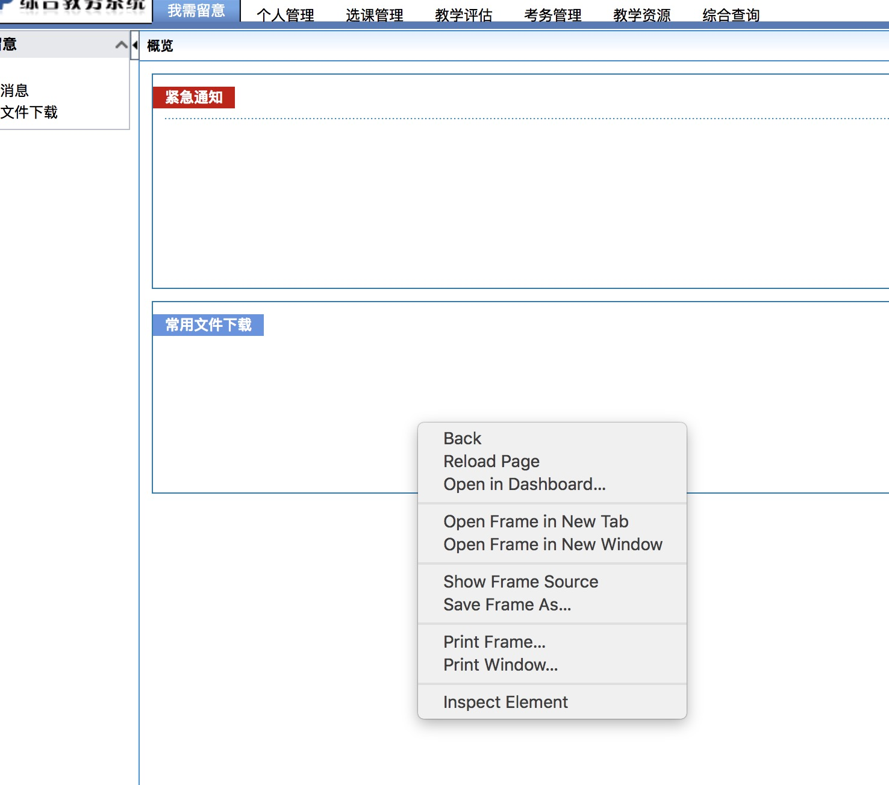
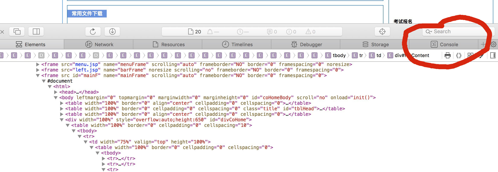
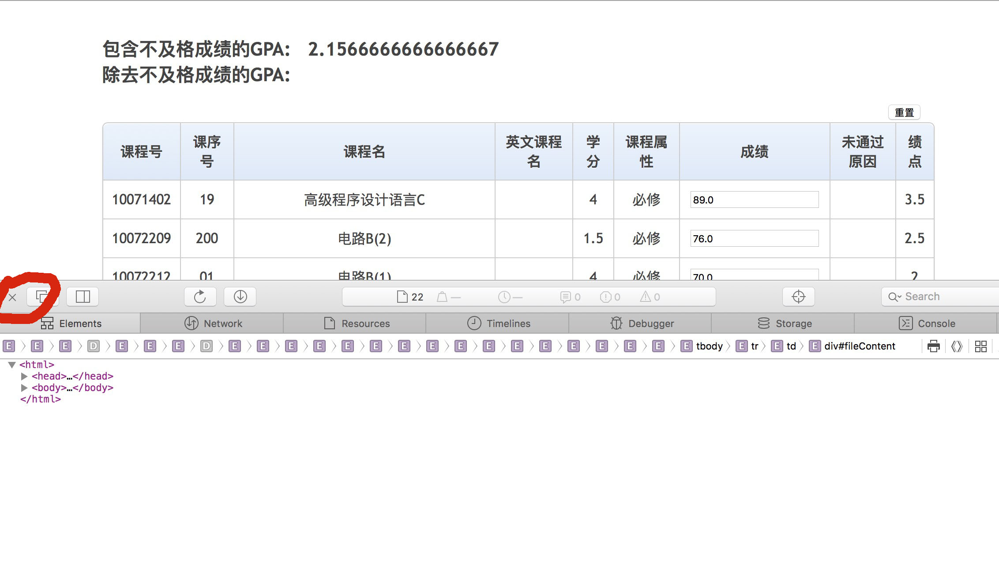

为本地而生的 JS 版，只支持内网访问。

[HOW TO USE](#使用)

[功能](#功能)

[文件目录介绍](#文件目录介绍)

[原理介绍](#原理介绍)

[支持的游览器](#支持的游览器)

[常见问题](#常见问题)
<div style="display: none;">
[请我喝康师傅？(我就是试试，看下有没有好心人)](#请我喝康师傅)
</div>
[TODO](#该添加的)


### 使用

<a href="https://www.bilibili.com/video/av22820823/" target="_blank">视频快速上手</a>

- 打开本目录下的 gpa.js 或[点击](/byJS/gpa.js)

- 复制 gpa.js 文件的所有代码

- 登录教务系统成功后，右键鼠标，点击审核元素(Inspect Element)，再点击控制台(console)，将刚才复制代码粘贴到 console 输入框中(有一栏可以输入)，回车即可。



- 关闭审核元素(有一个小叉叉，别关错了)，即可看到绩点结果，修改分数可模拟改后的绩点结果。



注: 分数为 0 ~ 100 或 优良中合格及格。

### 功能
```
查绩点，会显示所有的必修课成绩。

实时模拟修改成绩，会显示出修改后的绩点分数。也就是定一个重修的目标。
```
### 文件目录介绍
```
gpa.js 为获取课程表必修课的数据和 style.css 和 success.html 的合成文件

style.css 为样式

success.html 为生成的新页面
```
### 原理介绍
```
用 Ajax 获取到成绩，再解析后生成数组对象，然后用 Vue 生成视图(view)，Vue 绑定成绩(data)，即可实时修改成绩，计算绩点。

注：以前的 Java 版本并没有用 Vue，而是用的原生 JS。
```
### 支持的游览器
```
在 Mac 下, Chrome, Safari, Firefox, 都可以用

在 Win, Linux 除一些老的 IE 应该都能用吧。
```

### 常见问题
q: 什么是绩点，我为什么要查绩点

a: 你可以看下学生手册，应该在 100 多页

q: gpa.js 差不多 300 行代码，我怎么复制啊

a: 选择开头的几句代码，鼠标滚到最后，按住 shift 键，点击结尾处代码 -.-

q: 为什么我的不能用了？

a: 可以更换下游览器，或者 find me

q: 那怎么找你？

a: 这，你看根目录的文件夹中有一个 find me.jpg

<div style="display: none;">
### 请我喝康师傅


</div>

### 该添加的
```
应该加个排序就好了。
```
